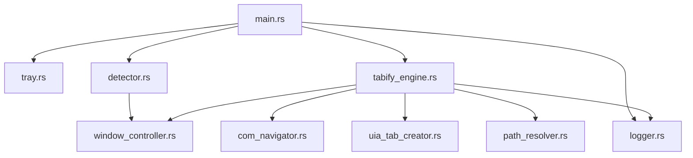

# TabifyExplorer

Windows 11 の新規エクスプローラーウィンドウを検出して既存ウィンドウのタブへ自動統合する、タスクバー常駐型ユーティリティツールです。
軽量な Win32 API / COM / DWM ネイティブ実装により、メモリ消費量の極小化と高速動作を実現しています。

---

## 概要

TabifyExplorer は、Windows 11 の標準エクスプローラー（`CabinetWClass`）で新しくウィンドウが開かれた際に、それを自動検知して既存のエクスプローラーの新しいタブとして統合するツールです。

イベントフック直後の即時 Cloak 処理によるフリッカーレス制御と、`IShellBrowser` / `IWebBrowser2` COM インターフェースによるダイレクトナビゲーションにより、画面のちらつきを完全に排除したスムーズな操作感を提供します。

詳細な設計および処理フローについては [仕様書](docs/specifications.md) を参照してください。

---

## 動作環境・仕様

| 項目 | 要件 / 仕様 |
| :--- | :--- |
| **名称** | TabifyExplorer |
| **バージョン** | v0.1.0 |
| **OS** | Windows 11（バージョン 22H2 以降のタブ対応エクスプローラー） |
| **開発言語** | Rust 2021 Edition |
| **動作形態** | スタンドアロン Win32 アプリケーション（タスクバー通知領域常駐） |
| **出力バイナリ** | `TabifyExplorer.exe` |

---

## アーキテクチャとモジュール構成

単一責任の原則（SRP）に基づく Rust モジュール構成：



### モジュール役割定義

- **`src/main.rs`**：エントリーポイント。単一インスタンス排他制御、プロセスキル、ログ初期化、トレイウィンドウおよび Win32 メッセージループを管理します。
- **`src/detector.rs`**：`WinEventHook`（`EVENT_OBJECT_CREATE`）および `ShellHook`（`HSHELL_WINDOWCREATED`）の低レイヤーイベントを監視し、検知直後に最速で非表示化を呼び出します。
- **`src/tabify_engine.rs`**：自動統合オーケストレーションエンジン。重複排除ガードおよびバックグラウンドウォッチャー（300ms 周期）を管理します。
- **`src/window_controller.rs`**：DWM レベルでの即時クローク（`DWMWA_CLOAKED`）、`SW_HIDE`、画面外退避（`-32000, -32000`）、元座標キャッシュ（`SAVED_RECTS`）、および `WM_SETREDRAW` 描画停止・復元を行います。
- **`src/com_navigator.rs`**：`IShellWindows` / `IWebBrowser2` / `IShellBrowser` COM インターフェース経由のパス取得およびダイレクトナビゲーションを担います。
- **`src/uia_tab_creator.rs`**：UI Automation (UIA) を経由して対象ウィンドウに安全なタブ生成ショートカット（`Ctrl+T`）を送信します。
- **`src/path_resolver.rs`**：ナビゲート可能フォルダ判定およびホームパス判定を提供します。
- **`src/tray.rs`**：システムトレイアイコンの登録とコンテキストメニュー処理を管理します。
- **`src/logger.rs`**：ファイルログ `TabifyExplorer.log` へのログ出力を行います。

---

## 主な機能と特徴

1. **フリッカーレス即時非表示**：イベントフック発生直後のコールバック関数内で直接ウィンドウを非表示化・Cloak し、画面のチラつきを一掃します。
2. **高速ダイレクトナビゲーション**：`IShellBrowser::BrowseObject` ネイティブ API により、アドレスバー操作の文字入力アニメーションを介さずダイレクトにタブを目的のフォルダへ切り替えます。
3. **キー・マウスバイパス**：Shift キー押下による単独ウィンドウ起動や、タブのドラッグ＆ドロップ切り離し操作を自動判定してバイパスします。
4. **低負荷常駐**：300ms ポーリング間隔とデバウンス処理により、CPU 消費とプロセス間 COM 通信負荷を最小限に留めます。

---

## ビルドおよび実行方法

### 必要環境

- Rust 1.80+ (MSVC ツールチェーン)
- Windows 11

### ビルドコマンド

```powershell
# デバッグビルド
cargo build

# リリースビルド (最適化済みバイナリ)
cargo build --release
```

出力バイナリ：`target/release/TabifyExplorer.exe`
