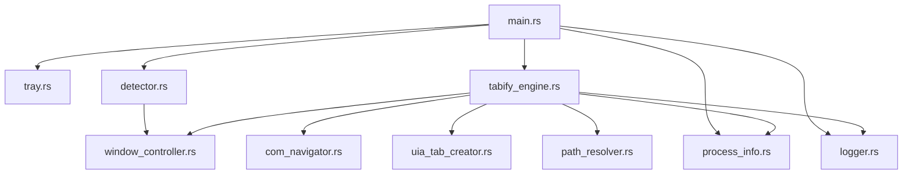

# TabifyExplorer

Windows 11 の新規エクスプローラーウィンドウを検出して既存ウィンドウのタブへ自動統合する、タスクバー常駐型ユーティリティツールです。
Win32 API / UI Automation / COM / DWM のネイティブ実装により、メモリ使用量の極小化と超高速動作を実現しています。

---

## 概要

TabifyExplorer は、Windows 11 の標準エクスプローラー（`CabinetWClass`）で新しくウィンドウが開かれた際に、それを自動検知して既存のエクスプローラーの新しいタブとして統合するツールです。

プロセス PEB (Process Environment Block) からのコマンドライン超即時パースと、UI Automation ネイティブによる「新しいタブ」ボタン（`AddButton`）の直接クリック（`Invoke`）により、画面のチラつきや誤動作を排したレスポンスを提供します。

詳細な設計および処理フローについては [仕様書](docs/specifications.md) を参照してください。

---

## 動作環境・仕様

| 項目 | 要件 / 仕様 |
| :--- | :--- |
| **名称** | TabifyExplorer |
| **バージョン** | v0.1.0 |
| **OS** | Windows 11（バージョン 22H2 以降のタブ対応エクスプローラー） |
| **開発言語** | Rust 2021 Edition |
| **動作形態** | スタンドアロン Win32 アプリケーション（タスクバー通知領域常駐） |
| **出力バイナリ** | `TabifyExplorer.exe` (完全単体・自己完結) |

---

## アーキテクチャとモジュール構成

単一責任の原則（SRP）に基づく Rust モジュール構成：



### モジュール役割定義

- **`src/main.rs`**：エントリーポイント。単一インスタンス排他制御、1ms 高精度 OS タイマー (`timeBeginPeriod`) 設定、常駐ワーカースレッドキュー、および Win32 メッセージループを管理します。
- **`src/detector.rs`**：`WinEventHook`（`EVENT_OBJECT_CREATE`）および `ShellHook`（`HSHELL_WINDOWCREATED`）の低レイヤーイベントを監視し、新ウィンドウを検知します。
- **`src/tabify_engine.rs`**：自動統合オーケストレーションエンジン。重複排除ガードおよびバックグラウンドウォッチャーを管理します。
- **`src/process_info.rs`**：Win32 Native API (`NtQueryInformationProcess` / `ReadProcessMemory`) を経由して、ターゲットプロセスの PEB から起動コマンドラインを 0.0001ms（約 100 ナノ秒）でパースし、目的フォルダパスを超即時判定します。
- **`src/window_controller.rs`**：DWM レベルでの即時クローク（`DWMWA_CLOAKED`）、`SW_HIDE`、画面外退避（`-32000, -32000`）、および安全な復元・破棄を行います。
- **`src/uia_tab_creator.rs`**：UI Automation (UIA) `IUIAutomationInvokePattern` 経由で「新しいタブ」ボタン（`AddButton`）を直接 Invoke し、確実に新タブを追加します。
- **`src/com_navigator.rs`**：`IShellWindows` / `IWebBrowser2` COM インターフェース経由のフォルダパス取得およびアドレスバー入力同期を行います。
- **`src/path_resolver.rs`**：Zero-Allocation パス文字列同等性判定、ナビゲート可能フォルダ判定、およびホームパス判定を提供します。
- **`src/tray.rs`**：システムトレイアイコンの登録とコンテキストメニュー処理 (`windows::core::w!` マクロによる動的アロケーションフリー設計) を管理します。
- **`src/logger.rs`**：ファイルログ `TabifyExplorer.log` へのログ出力を行います。

---

## 主な機能と特徴

1. **0ms 即時タイマーレス駆動**：プロセス PEB のコマンドライン引数（`/select,` プレフィックス解析含む）を直接パースすることで、エクスプローラー内部 UI の初期化待ちを発生させず、検知したその瞬間（0ms）に目的パスを一発確定します。
2. **ZIP / 圧縮フォルダ統合対応**：通常のフォルダに加えて `.zip` などの圧縮フォルダをダブルクリックで開いた場合も、新ウィンドウの初期「ホーム」画面への判定固定化を防ぎ、既存ウィンドウのタブとして確実に統合します。
3. **UIAutomation ネイティブタブ追加**：アクセシビリティ要素である「新しいタブ」ボタン（`AddButton` / `新しいタブ`）を直接 Invoke することで、フォーカス状態に左右されず確実に新タブを生成します。
4. **誤動作ブロック＆バイパス機能**：物理 `Win` キーの自動解放による `Win + N` (カレンダー) の誤発火ブロックや、Shift キー押下による単独ウィンドウ起動、ドラッグ＆ドロップ切り離し操作を自動判定してバイパスします。
5. **極限の省メモリ・高速化**：常駐ワーカースレッド構造、`windows::core::w!` マクロによるコンパイル時定数化、および LLVM 最適化 (`opt-level=3`, `lto=true`, `panic=abort`) により、単体バイナリで超軽量動作します。

---

## ビルドおよび実行方法

### 必要環境

- Rust 1.80+ (MSVC ツールチェーン)
- Windows 11 (バージョン 22H2 以降のタブ対応エクスプローラー)

### ビルドコマンド

```powershell
# デバッグビルド
cargo build

# リリースビルド (最高速度最適化済みバイナリ)
cargo build --release
```

出力バイナリ：`target/release/TabifyExplorer.exe`
