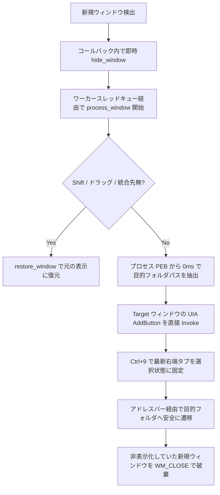

# TabifyExplorer 仕様書

TabifyExplorer は、Windows 11 の標準エクスプローラー（`CabinetWClass`）で開かれた新規ウィンドウを検知し、既存のエクスプローラーウィンドウへ新しいタブとして自動統合するタスクバー常駐型 Win32 ユーティリティです。

---

## 1. 概要と目的

Windows 11 のエクスプローラーでは、外部アプリケーションやショートカットからフォルダを開いた際に、新しいウィンドウとして起動することがあります。
TabifyExplorer は、この新規ウィンドウの発生を OS レベルで即時検知し、画面のチラつき（フリッカー）を発生させずに既存ウィンドウの新しいタブへ自動統合します。

---

## 2. システムアーキテクチャ

本ツールは純粋な Rust 2021 Edition と Win32 / UI Automation / COM / DWM ネイティブ API により構築されています。

### 構成モジュール

* **`main.rs`**：エントリーポイント。単一インスタンス排他制御、1ms 高精度 OS タイマー（`timeBeginPeriod`）、常駐ワーカースレッドキュー、および Win32 メッセージループを管理します。
* **`detector.rs`**：`WinEventHook`（`EVENT_OBJECT_CREATE`）および `ShellHook`（`HSHELL_WINDOWCREATED`）の低レイヤーイベントフックを管理します。
* **`tabify_engine.rs`**：タブ統合処理の主要ロジック（`process_window`）およびバックグラウンドウォッチャーを実行します。
* **`process_info.rs`**：Win32 Native API（`NtQueryInformationProcess` / `ReadProcessMemory`）を経由して、ターゲットプロセスの PEB から起動コマンドラインを 0.0001ms（約 100 ナノ秒）でパースし、目的フォルダパスを超即時判定します。
* **`window_controller.rs`**：ウィンドウのフリッカーレス隠蔽（`DWMWA_CLOAKED`）、画面外退避、元位置のキャッシュ（`SAVED_RECTS`）、および安全な表示状態の復元・破棄を行います。
* **`com_navigator.rs`**：`IShellWindows` / `IWebBrowser2` COM インターフェースを利用したフォルダパス取得およびアドレスバー入力同期を行います。
* **`uia_tab_creator.rs`**：UI Automation (UIA) `IUIAutomationInvokePattern` を利用して「新しいタブ」ボタン（`AddButton`）を直接 Invoke し、確実に新タブを追加します。
* **`path_resolver.rs`**：Zero-Allocation パス文字列同等性判定、ナビゲート可能フォルダ判定、およびホームパス判定を提供します。
* **`tray.rs`**：システムトレイアイコンの登録とコンテキストメニュー (`windows::core::w!` マクロによるコンパイル時定数化) を管理します。
* **`logger.rs`**：ログファイル `TabifyExplorer.log` へのログ書き込みを担当します。

---

## 3. フリッカーレス（ちらつき防止）隠蔽仕様

新規ウィンドウが画面上に一瞬描画されるフラッシュ現象を防ぐため、二段階の隠蔽および描画停止制御を導入しています。

### コールバック直前の最速隠蔽

フック関数 `win_event_proc` または `shell_hook_window_proc` が OS から呼び出された直後、スレッド間メッセージチャネル送信前のコールバック内で直接 `window_controller::hide_window` を実行します。
OS がウィンドウの初回フレームを描画する前に表示抑制をかけます。

### 隠蔽処理の手順

1. **`DWMWA_CLOAKED`**：DWM レベルで即時クロークを設定し、レンダリングターゲットから除外します。
2. **`DWMWA_TRANSITIONS_FORCEDISABLED`**：OS のウィンドウアニメーション効果を無効化します。
3. **`ShowWindow(SW_HIDE)`**：ウィンドウの表示状態を非表示に更新します。
4. **`SetWindowPos`**：画面外座標（`-32000, -32000`）へ位置を転送します。
5. **`WM_SETREDRAW`**：`LPARAM(0)` を送信し、ウィンドウの再描画を停止します。

---

## 4. タブ自動統合アルゴリズム仕様

### 処理フロー

### パス解析およびタブ生成の技術

1. **0ms PEB 直接パース**：`NtQueryInformationProcess` を介してプロセスパラメータ（`RTL_USER_PROCESS_PARAMETERS`）の `CommandLine` を直接読み取ることで、エクスプローラー内部 UI の初期化を 1ms も待たずに 0.0001ms で目的パスを確定します。
2. **UIA 直接 Invoke**：アクセシビリティ API `IUIAutomationInvokePattern` 経由で「新しいタブ」ボタン（`AddButton`）を直接 Invoke することで、フォーカス状態に関わらず 100% 確実に新タブを生成します。

---

## 5. レスポンス・パフォーマンス最適化仕様

* **1ms 高精度 OS タイマー**：`timeBeginPeriod(1)` を呼び出し、Windows カーネルのシステムタイマー解像度を `1.000ms` へ強制引き上げ。
* **常駐ワーカースレッド構造**：イベント受領時の OS スレッド生成コストを全廃し、専用の単一常駐ワーカースレッドで順次処理。
* **Zero-Allocation メモリ設計**：`windows::core::w!` マクロによるコンパイル時定数化と `eq_ignore_ascii_case` により、実行時ヒープアロケーションを最小化。
* **LLVM 最速最適化**：`opt-level = 3`, `lto = true`, `codegen-units = 1`, `panic = "abort"` により、極速・超軽量バイナリを出力。

---

## 6. ショートカット・手動操作仕様

* **Shift キー押下時**：新規ウィンドウ生成時に Shift キーが押されている場合、自動タブ化をスキップし単独ウィンドウとして起動します。
* **ドラッグ操作時**：マウス左ボタン長押しが検知された場合、タブドラッグアウト操作と判定して自動タブ化をスキップします。
