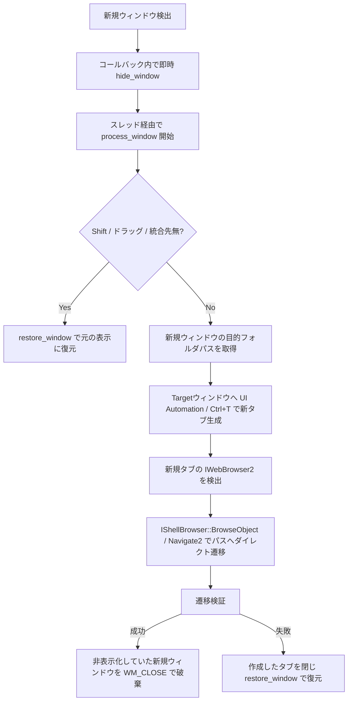

# TabifyExplorer 仕様書

TabifyExplorer は、Windows 11 の標準エクスプローラー（`CabinetWClass`）で開かれた新規ウィンドウを検知し、既存のエクスプローラーウィンドウへ新しいタブとして自動統合するタスクバー常駐型 Win32 ユーティリティです。

---

## 1. 概要と目的

Windows 11 のエクスプローラーでは、外部アプリケーションやショートカットからフォルダを開いた際に新しいウィンドウとして起動する挙動をとることがあります。
TabifyExplorer は、この新規ウィンドウ発生を OS レベルで即時検知し、画面のちらつき（フリッカー）を発生させずに既存ウィンドウの新しいタブへ自動結合します。

---

## 2. システムアーキテクチャ

本ツールは純粋な Rust と Windows API (Win32 / COM / DWM) により構築されています。

### 構成コンポーネント

- **`main.rs`**：エントリーポイント。単一インスタンス排他制御、二重起動プロセスキル、ログ初期化、トレイウィンドウ生成、および Win32 メッセージループを管理します。
- **`detector.rs`**：`WinEventHook`（`EVENT_OBJECT_CREATE`）および `ShellHook`（`HSHELL_WINDOWCREATED`）の低レイヤーイベントフックを管理します。
- **`tabify_engine.rs`**：タブ統合処理の主要ロジック（`process_window`）およびバックグラウンドウォッチャー（`start_background_watcher`）を実行します。
- **`window_controller.rs`**：ウィンドウのフリッカーレス隠蔽、画面外退避、元位置のキャッシュ（`SAVED_RECTS`）、および表示状態の復元を行います。
- **`com_navigator.rs`**：`IShellWindows` / `IWebBrowser2` / `IShellBrowser` COM インターフェースを利用したパス取得およびダイレクトナビゲーションを担います。
- **`uia_tab_creator.rs`**：UI Automation (UIA) を利用して対象ウィンドウに新規タブ生成ショートカットコマンドを安全に供給します。
- **`path_resolver.rs`**：ナビゲート可能フォルダ判定およびホームパス判定を提供します。
- **`tray.rs`**：システムトレイアイコンの登録とコンテキストメニューのメッセージ処理を行います。
- **`logger.rs`**：ログファイル `TabifyExplorer.log` へのログ書き込みを担当します。

---

## 3. フリッカーレス（ちらつき防止）隠蔽仕様

新規ウィンドウが画面上に一瞬描画されるフラッシュ現象を防ぐため、二段階の隠蔽および描画停止制御を導入しています。

### コールバック直前の最速隠蔽

フック関数 `win_event_proc` または `shell_hook_window_proc` が OS から呼び出された直後、スレッド間メッセージチャネル送信前のコールバック内で直接 `window_controller::hide_window` を実行します。
OS がウィンドウの初回フレームを描画する前に表示抑制をかけます。

### 隠蔽処理の手順

1. **`DWMWA_CLOAKED`**：DWM レベルで即時クロークを設定し、レンダリングターゲットから除外します。
2. **`DWMWA_TRANSITIONS_FORCEDISABLED`**：OS のウィンドウアニメーション効果を無効化します。
3. **`ShowWindow(SW_HIDE)`**：ウィンドウの表示状態を非表示に更新します。
4. **`SetWindowPos`**：画面外座標（`-32000, -32000`）へ位置を転送します。
5. **`WM_SETREDRAW`**：LPARAM(0) を送信し、ウィンドウの再描画を停止します。

### 元位置の保持と復元（`SAVED_RECTS`）

先行隠蔽時に `GetWindowRect` で取得した元のウィンドウ領域座標は、スレッドセーフな `SAVED_RECTS` グローバルキャッシュに保存されます。
自動タブ化のスキップ条件（Shift キー押下、ドラッグ操作、統合先不在等）に該当した場合は、`restore_window` を呼出し、`WM_SETREDRAW(1)` $\rightarrow$ 元座標移動 $\rightarrow$ `SW_SHOW` $\rightarrow$ Cloak 解除 $\rightarrow$ `RedrawWindow` の順序で元の位置へ正確に復元します。

---

## 4. タブ自動統合アルゴリズム仕様

### 処理フロー

### ナビゲーション優先順位

1. **`IShellBrowser::BrowseObject`**：ネイティブ Shell API を使用し、PIDL 経由で直接ターゲットフォルダへ切り替えます。
2. **`IWebBrowser2::Navigate2`**：COM インターフェースの URL メソッド呼び出しによる遷移を行います。
3. **アドレスバーキー送信フォールバック**：上記 COM 呼び出しが完了しない場合にのみ、`WM_SETREDRAW(0)` 制御のもとで `Alt+D` と Unicode 文字列送信を実行します。

---

## 5. レスポンス・パフォーマンス最適化仕様

### ポーリング間隔の最適化

バックグラウンドウォッチャー（`start_background_watcher`）による `IShellWindows` 列挙ループの間隔を 300ms に調整しています。
COM インターフェースの過剰呼び出しを防止し、CPU 消費およびエクスプローラープロセスとの通信オーバーヘッドを抑えます。

### デバウンス処理

同一 HWND に対する 300ms 以内の連続イベント通知を自動スキップするデバウンス判定を `detector.rs` に備えています。
二重イベント受領による無駄なスレッド生成や処理の競合を抑止します。

---

## 6. ショートカット・手動操作仕様

- **Shift キー押下時**：新規ウィンドウ生成時に Shift キーが押されている場合、自動タブ化をスキップし単独ウィンドウとして起動します。
- **ドラッグ操作時**：マウス左ボタン長押しが検知された場合、タブドラッグアウト操作と判定して自動タブ化をスキップします。
